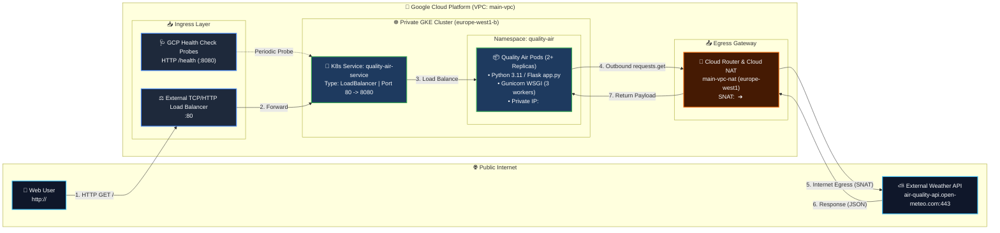

# ☁️ Quality Air Application — System & Network Architecture

This document provides the high-level system architecture and in-depth technical specifications for every Google Cloud Platform (GCP) and Kubernetes service powering the **Quality Air** application.

---

## 🗺️ 1. Architecture Diagram

---

## 🔍 2. Detailed Service Specifications

### 1. External Load Balancer (GCP Ingress Layer)
- **Component:** Google Cloud Network Load Balancer (managed automatically via GKE Service controller).
- **Public Entry Point:** `<EXTERNAL_LB_IP>` on port `80` (HTTP).
- **Role:** 
  - Receives incoming client HTTP traffic from the public internet.
  - Forwards requests across healthy cluster worker nodes using destination hashing.
- **Directionality:** **Inbound (Ingress) only**. The load balancer routes external requests into the cluster, but cannot be used by pods to establish new outbound outbound connections to external third-party services.
- **Health Checks:** Continuously queries `/health` via GCP probe ranges to ensure backend nodes and pods are operational.

---

### 2. Google Virtual Private Cloud (VPC) & Subnets
- **Component:** `google_compute_network` (`main-vpc`) and `google_compute_subnetwork` (`main-vpc-subnet`).
- **Primary CIDR Block:** `<SUBNET_CIDR>` (Regional: `europe-west1`).
- **Secondary CIDR Ranges (Alias IPs):**
  - **Pods Range:** Dedicated IP range reserved exclusively for Kubernetes Pod allocation.
  - **Services Range:** Dedicated IP range reserved for Kubernetes ClusterIP service endpoints.
- **Security & Isolation:** `auto_create_subnetworks = false` prevents default non-segmented VPC topologies and provides strict IP address control.

---

### 3. VPC Firewall Rules
- **Component:** `google_compute_firewall`.
- **Ingress Security:**
  - **`allow-internal`:** Permits intra-VPC communication across all ports for resources within `<SUBNET_CIDR>`.
  - **`allow-health-checks`:** Allows Google Cloud distributed health checker systems to query node ports on port `8080`.
  - **`allow-iap-ssh`:** Permits administrative access strictly via Google Identity-Aware Proxy (IAP) without requiring public IP bastion hosts.
- **Egress Security:**
  - Governed by GCP's default implied egress rule (`default-allow-egress`), which allows all outbound traffic to `0.0.0.0/0` unless an explicit deny rule is enforced.

---

### 4. Google Kubernetes Engine (Private GKE Cluster)
- **Component:** `google_container_cluster` (`main-gke-cluster`) & `google_container_node_pool`.
- **Topology:** Zonal cluster deployed in `europe-west1-b`.
- **Private Cluster Architecture:**
  - **`enable_private_nodes = true`:** Worker nodes do **not** have public IP addresses. They communicate exclusively using private RFC 1918 IP addresses.
  - **`enable_private_endpoint = false`:** Cluster master API remains reachable by authorized DevOps tools while node workloads stay fully isolated from direct internet access.
- **Compute Optimization:** Configured with Spot VMs (`spot = true`) to maximize cost savings for ephemeral stateless workloads.

---

### 5. Kubernetes Service (`quality-air-service`)
- **Manifest:** `qualityAirApp/k8s/service.yaml`.
- **Service Type:** `LoadBalancer`.
- **Networking Configuration:**
  - **`port: 80`:** The external service port exposed on the Load Balancer.
  - **`targetPort: 8080`:** The internal container port where Gunicorn listens.
  - **`ClusterIP` (`<CLUSTER_IP>`):** Internal virtual IP used for service discovery within the cluster.
- **Traffic Routing:** Uses Kubernetes label selectors (`app: quality-air-app`) to perform layer-4 round-robin distribution to ready pods.

---

### 6. Quality Air Application Pods (Deployment & Runtime)
- **Manifests:** `qualityAirApp/k8s/deployment.yaml` & `qualityAirApp/app.py`.
- **Runtime Stack:** Python 3.11-slim, Flask, and Gunicorn WSGI server configured with 3 concurrent sync workers (`--workers 3`).
- **High Availability & Autoscaling:**
  - **Replicas:** Minimum 2 pods with rolling update strategy (`maxSurge: 1`, `maxUnavailable: 0`).
  - **HPA (`quality-air-hpa`):** Dynamically scales pods from 2 to 5 based on target CPU utilization (70%).
- **Health Check Strategy:**
  - **Shallow Health Checks:** The `/health` endpoint validates only local web server liveness (returning HTTP 200).
  - **Cascading Failure Prevention:** Third-party APIs are explicitly excluded from the Kubernetes health probe to prevent pods from entering continuous restart loops (`CrashLoopBackOff`) if the external provider experiences temporary downtime.
- **Resilience & Fallback:** If external data cannot be retrieved, the application gracefully returns fallback states (`UNAVAILABLE`) instead of crashing.

---

### 7. Cloud Router & Cloud NAT (Egress Gateway)
- **Component:** `google_compute_router` (`main-vpc-router`) & `google_compute_router_nat` (`main-vpc-nat`).
- **Configuration:** `AUTO_ONLY` allocation with `ALL_SUBNETWORKS_ALL_IP_RANGES`.
- **Role:**
  - Provides managed outbound internet connectivity for private GKE nodes and pods that do not have external public IP addresses.
  - **Source Network Address Translation (SNAT):** Rewrites private pod source IPs (`<POD_IP>`) to dynamic Google Cloud public IP addresses (`<NAT_PUBLIC_IP>`) before routing packets across the internet.
- **Criticality:** Without Cloud NAT, private cluster workloads cannot resolve external DNS names or connect to external third-party APIs (such as Open-Meteo).

---

### 8. External Air Quality API (Open-Meteo)
- **Endpoint:** `https://air-quality-api.open-meteo.com/v1/air-quality` (Port 443 HTTPS).
- **Role:** Third-party data provider delivering real-time European Air Quality Index (AQI), PM2.5, PM10, NO2, and Ozone metrics.
- **Timeout Management:** Inbound calls from `app.py` use a strict `timeout=3.5s` to prevent slow responses from exceeding Gunicorn's 30-second worker execution ceiling.

---

### 9. Observability & SRE Pipeline
- **Components:** Cloud Logging Agent, Cloud Logging Sink (`k8s-to-bigquery`), and BigQuery Dataset (`k8s_logs`).
- **Structured JSON Logging:** Every HTTP request and warning is streamed directly via `stdout`/`stderr` with structured GCP metadata (`severity`, `latency_ms`, `httpRequest`).
- **Log Routing:** Kubernetes container logs in namespace `quality-air` are automatically routed to BigQuery for long-term auditability, query analysis, and alerting on silent degradation.
