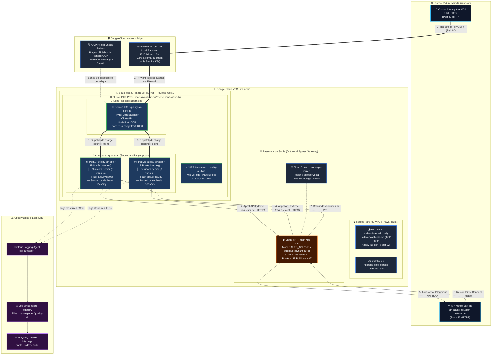

# ☁️ Architecture Réseau & Kubernetes - Quality Air Application

Ce document détaille l'architecture complète, les flux réseau (Ingress & Egress), la configuration Kubernetes/GCP et les mécanismes de résilience de l'application **Quality Air**.

---

## 🗺️ 1. Schéma d'Architecture Global



---

## 🔄 2. Les Deux Chemins Réseau Fondamentaux

L'application repose sur deux flux réseau complètement indépendants :

### 🔵 Flux A : Trafic Entrant (*Ingress*) — La visite de l'utilisateur
1. **L'utilisateur** tape `http://<EXTERNAL_LB_IP>` dans son navigateur.
2. La requête arrive sur le **Google Cloud External Load Balancer**.
3. Le **Firewall GCP** autorise le trafic vers le cluster GKE.
4. Le **Service Kubernetes** (`quality-air-service` de type `LoadBalancer`) intercepte la requête sur le port `80` et la transmet au port cible `8080` de l'un des pods.
5. Le serveur web **Gunicorn / Flask** reçoit la requête et génère le code HTML de la page d'accueil.

### 🟠 Flux B : Trafic Sortant (*Egress*) — La récupération des données météo
1. Pendant que le pod génère le tableau de bord, son code Python exécute :
   ```python
   requests.get("https://air-quality-api.open-meteo.com/v1/air-quality?...")
   ```
2. **Problème de départ :** Le cluster GKE est **privé** (`enable_private_nodes = true`). Ses nœuds et ses pods ne possèdent **aucune adresse IP publique**.
3. **La solution :** Le paquet sortant est orienté par le **Cloud Router** vers la passerelle **Cloud NAT** (`main-vpc-nat`).
4. **Le Cloud NAT (SNAT) :** Il remplace l'adresse IP privée interne du pod (`<POD_IP>`) par l'adresse IP publique allouée par le NAT (`<NAT_PUBLIC_IP>`) et contacte l'API Open-Meteo sur le port `443` (HTTPS).
5. Open-Meteo renvoie la réponse au NAT, qui la retransmet au pod.
6. Le pod intègre les indices de pollution dans le HTML et renvoie la page complète à l'utilisateur.

---

## 📂 3. Correspondance avec le Code du Projet

| Composant | Rôle dans l'Architecture | Fichier Source dans le Projet |
| :--- | :--- | :--- |
| **VPC & Subnet** | Réseau virtuel isolé (`var.subnet_cidr`) avec plages secondaires pour GKE | [modules/network/main.tf](file:///Users/benjixxx/gcp-revision/modules/network/main.tf) |
| **Cloud Router & NAT** | Passerelle de sortie vers Internet pour les pods privés | [modules/network/main.tf#L31-L43](file:///Users/benjixxx/gcp-revision/modules/network/main.tf#L31-L43) |
| **Firewall Rules** | Autorisations internes, sondes de santé et accès IAP | [modules/network/main.tf#L45-L77](file:///Users/benjixxx/gcp-revision/modules/network/main.tf#L45-L77) |
| **Cluster GKE Privé** | Orchestrateur Kubernetes avec nœuds privés Spot | [modules/gke/main.tf](file:///Users/benjixxx/gcp-revision/modules/gke/main.tf) |
| **Service LoadBalancer** | Exposition publique de l'application sur le port 80 | [qualityAirApp/k8s/service.yaml](file:///Users/benjixxx/gcp-revision/qualityAirApp/k8s/service.yaml) |
| **Deployment & Probes** | Déploiement des réplicas, sondes `/health` et limites CPU/RAM | [qualityAirApp/k8s/deployment.yaml](file:///Users/benjixxx/gcp-revision/qualityAirApp/k8s/deployment.yaml) |
| **Code Flask & Logger** | Application Python, gestion du fallback et logs JSON GCP | [qualityAirApp/app.py](file:///Users/benjixxx/gcp-revision/qualityAirApp/app.py) |
| **Sink BigQuery** | Exportation des logs d'erreurs GKE vers BigQuery | [modules/logging_monitoring/main.tf](file:///Users/benjixxx/gcp-revision/modules/logging_monitoring/main.tf) |

---

## 🛠️ 4. Retour d'Expérience & Résolution de Panne (*Post-Mortem*)

### Le Symptôme :
- Les pods étaient affichés en vert : **`1/1 Running (0 restarts)`**.
- Le Load Balancer était fonctionnel : **`200 OK` sur `/health`**.
- Mais l'application affichait **`UNAVAILABLE`** pour toutes les villes.

### La Cause Racine :
La passerelle **Cloud NAT** n'était plus active sur le VPC. Sans Cloud NAT :
- Le trafic entrant (Ingress) continuait de fonctionner (l'utilisateur voyait bien la page HTML).
- Le trafic sortant (Egress) était bloqué : les pods ne pouvaient pas sortir vers l'API météo externe.
- Le code Flask basculait silencieusement sur son mode dégradé (*fallback*).

### Pourquoi les Pods sont restés « Verts » ?
La sonde de santé Kubernetes (`readinessProbe` & `livenessProbe`) teste l'endpoint local `/health` :
- Tester une dépendance externe dans le health check aurait entraîné le redémarrage en boucle des pods (*CrashLoopBackOff*) et une erreur 502 Bad Gateway.
- Le mode dégradé a permis de conserver l'interface accessible pendant l'incident.

### La Résolution :
La réapplication du module Terraform réseau a recréé la ressource `google_compute_router_nat` :
```bash
terraform apply -target=module.network
```
Les pods ont immédiatement retrouvé leur route de sortie vers Internet.

---

## 🚀 5. Commandes Utiles pour l'Exploitation (Cheat Sheet OPS)

```bash
# 1. Se connecter au cluster GKE
gcloud container clusters get-credentials <CLUSTER_NAME> --zone <ZONE> --project <PROJECT_ID>

# 2. Vérifier l'état des pods et du service (IP externe et ports)
kubectl get pods,svc -n quality-air -o wide

# 3. Tester la sortie Internet depuis l'intérieur d'un pod
kubectl exec -n quality-air -l app=quality-air-app -- curl -I -m 5 https://air-quality-api.open-meteo.com

# 4. Vérifier l'état de la passerelle Cloud NAT
gcloud compute routers nats list --router=main-vpc-router --region=<REGION>

# 5. Consulter les logs d'erreurs de l'application
kubectl logs -l app=quality-air-app -n quality-air --tail=50
```
