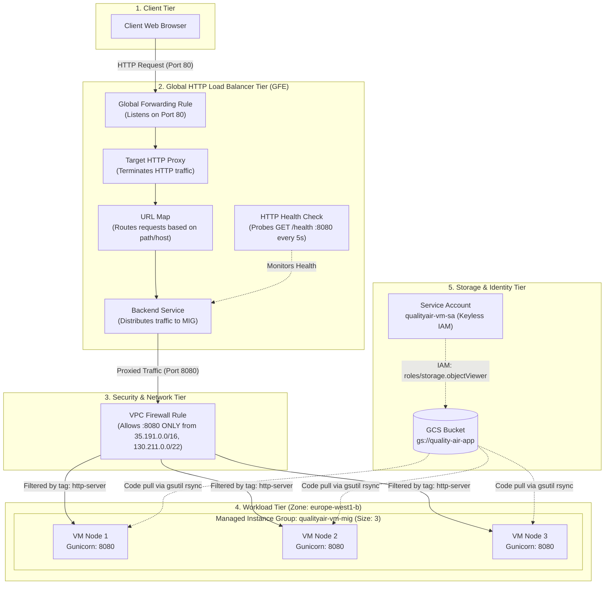

# GCP Compute Engine & Cloud Load Balancing Module
## QualityAirApp: High-Availability MIG & Global External HTTP Load Balancer

This module provisions a production-ready, fault-tolerant infrastructure on Google Cloud Platform (GCP) using **Terraform**, **Compute Engine**, **Managed Instance Groups (MIG)**, and a **Global External HTTP Application Load Balancer**.

---

## 📑 Table of Contents
1. [Architectural Overview](#1-architectural-overview)
2. [GCP Core Concepts Explained](#2-gcp-core-concepts-explained)
   - [Global Forwarding Rule](#global-forwarding-rule)
   - [Target HTTP Proxy](#target-http-proxy)
   - [URL Map](#url-map)
   - [Backend Service](#backend-service)
   - [Health Check](#health-check)
   - [Instance Template](#instance-template)
   - [Managed Instance Group (MIG)](#managed-instance-group-mig)
   - [VPC Firewall Rules](#vpc-firewall-rules)
   - [Keyless IAM & Bucket Storage](#keyless-iam--bucket-storage)
3. [The GCP Load Balancer Hierarchy](#3-the-gcp-load-balancer-hierarchy)
4. [Rolling Updates & Zero-Downtime Deployments](#4-rolling-updates--zero-downtime-deployments)
5. [Automated Node Bootstrapping (Startup Script)](#5-automated-node-bootstrapping-startup-script)
6. [Terraform Module Reference (Inputs & Outputs)](#6-terraform-module-reference-inputs--outputs)
7. [Complete CLI Operational Playbook](#7-complete-cli-operational-playbook)
8. [20 Essential GCP CLI Commands for Compute Engine](#8-20-essential-gcp-cli-commands-for-compute-engine)

---

## 1. Architectural Overview



---

## 2. GCP Core Concepts Explained

### Global Forwarding Rule
- **What it is:** The public frontend IP and entry point of your Load Balancer.
- **Role in our stack:** Listens on standard public **Port 80** and routes all incoming TCP packets to our Target HTTP Proxy.
- **Terraform Resource:** `google_compute_global_forwarding_rule.app_forwarding_rule`
- **Key Insight:** Without a pre-allocated static IP address (`google_compute_global_address`), destroying and recreating the forwarding rule allocates a **new dynamic external IP**.

---

### Target HTTP Proxy
- **What it is:** An internal Google Front End (GFE) component that terminates incoming client HTTP connections.
- **Role in our stack:** Receives raw HTTP requests from the Forwarding Rule, inspects HTTP headers, and consults the URL Map to determine where the request should go.
- **Terraform Resource:** `google_compute_target_http_proxy.app_http_proxy`

---

### URL Map
- **What it is:** The Layer 7 (Application Layer) routing engine of the Load Balancer.
- **Role in our stack:** Maps request hostnames and URL paths to backend services. In our configuration, the default service routes all traffic `/*` directly to our Backend Service.
- **Terraform Resource:** `google_compute_url_map.app_url_map`

---

### Backend Service
- **What it is:** The core orchestrator of backend traffic. It maintains the pool of backend endpoints, load-balancing algorithms, session affinity, and timeout configurations.
- **Role in our stack:**
  - Connects to the Managed Instance Group using named port `"http"` (**Port 8080**).
  - Uses `balancing_mode = "UTILIZATION"` to dynamically distribute requests.
  - Subscribes to the Health Check to only route traffic to healthy VMs.
- **Terraform Resource:** `google_compute_backend_service.app_backend`

---

### Health Check
- **What it is:** A centralized prober that continuously queries backend instances to ensure they are alive and ready to serve traffic.
- **Role in our stack:**
  - Executes `GET /health` on **Port 8080** every 5 seconds.
  - **Thresholds:** Requires 2 consecutive successes to mark a VM `HEALTHY`, and 2 consecutive failures to mark it `UNHEALTHY`.
  - If an instance fails, the Load Balancer immediately cuts off traffic to that instance without returning errors to end users.
- **Terraform Resource:** `google_compute_health_check.app_hc`

---

### Instance Template
- **What it is:** An immutable blueprint used by Compute Engine to create identical VM instances.
- **Role in our stack:**
  - Machine specs: `e2-micro`, minimal Debian 12 OS.
  - Network tags: `["http-server", "ssh-enabled", "mig-node"]`.
  - Service Account: Attaches `qualityair-vm-sa` with `cloud-platform` scope.
  - Metadata: Embeds `startup-script.sh` to install dependencies and run the application on boot.
- **Terraform Resource:** `google_compute_instance_template.app_template`

---

### Managed Instance Group (MIG)
- **What it is:** A collection of Compute Engine VMs based on an Instance Template that is managed as a single entity.
- **Role in our stack:**
  - Maintains `target_size = 3` identical VM nodes across `europe-west1-b`.
  - Exposes named port `http: 8080` to the Load Balancer.
  - Enables **automated healing** (recreating broken instances) and **zero-downtime rolling updates**.
- **Terraform Resource:** `google_compute_instance_group_manager.app_mig`

---

### VPC Firewall Rules
- **What it is:** Network ingress/egress security filters applied to VPC networks and VM instances via network tags.
- **Role in our stack:**
  - Rule `qualityair-vm-allow-lb-hc` allows TCP port `8080` **strictly** from Google's Load Balancer and Health Check IP ranges:
    - `35.191.0.0/16`
    - `130.211.0.0/22`
  - Targets VMs with tag `http-server`.
  - **Security Benefit:** Prevents direct unauthorized internet traffic on port 8080. All public requests must transit through the Load Balancer on port 80.

---

### Keyless IAM & Bucket Storage
- **Dedicated Service Account (`qualityair-vm-sa`):** Attached to each VM identity.
- **Keyless Authentication:** The VM acquires short-lived OAuth access tokens automatically through the Google Metadata Server (`http://metadata.google.internal/`). **Zero JSON private keys are stored on disk.**
- **Least Privilege Access:** Role `roles/storage.objectViewer` is bound strictly to `gs://quality-air-app`, preventing VMs from accessing other buckets or GCP resources.

---

## 3. The GCP Load Balancer Hierarchy

```
[ Internet Client ]
        │
        ▼ (Port 80)
[ google_compute_global_forwarding_rule ] (External Public IP)
        │
        ▼
[ google_compute_target_http_proxy ] (Terminates HTTP connection)
        │
        ▼
[ google_compute_url_map ] (L7 Path & Host Routing)
        │
        ▼
[ google_compute_backend_service ] (Utilization mode + Health Check)
        │
        ▼ (Port 8080)
[ google_compute_instance_group_manager ] (MIG: 3 VMs in europe-west1-b)
```

---

## 4. Rolling Updates & Zero-Downtime Deployments

When the application code or startup script changes, we must roll out the updates to the 3 instances in the MIG.

### `replace` vs. `restart`

| Action | Command | What It Does | When to Use |
| :--- | :--- | :--- | :--- |
| **Rolling Replace** | `rolling-action replace` | Destroys the VM and creates a brand-new VM from the latest instance template. | **Always use for script/template updates** to guarantee fresh boot and clean setup. |
| **Rolling Restart** | `rolling-action restart` | Performs a warm OS reboot of the existing VM. | Kernel updates or simple service reboot. Does NOT pull new template settings. |

### Zero-Downtime Surge Mechanics
```bash
gcloud compute instance-groups managed rolling-action replace qualityair-vm-mig \
    --zone=europe-west1-b \
    --max-surge=1 \
    --max-unavailable=0
```
- `--max-surge=1`: GCP spins up a **4th VM** first with the new configuration.
- `--max-unavailable=0`: GCP does not terminate an existing VM until the new VM has passed the health check (`HEALTHY`).
- The Load Balancer seamlessly shifts traffic without dropping a single user request.

### How to Check Which Instances Are Updated
```bash
gcloud compute instance-groups managed list-instances qualityair-vm-mig \
    --zone=europe-west1-b \
    --format="table(name, instanceTemplate.basename(), currentAction, status)"
```
- **`CURRENT_ACTION = NONE`**: VM is fully deployed and stable.
- **`CURRENT_ACTION = CREATING / RECREATING`**: VM is actively booting.
- **`INSTANCE_TEMPLATE`**: Shows whether the node is running the latest template version.

---

## 5. Automated Node Bootstrapping (Startup Script)

When a node starts, the Compute Engine guest environment executes `qualityAirApp/startup-script.sh`:

1. **Prerequisites Installation:** Installs `python3-pip`, `python3-venv`, `python3.11-venv`.
2. **Artifact Synchronization:** Runs `gsutil -m rsync -r gs://quality-air-app/qualityAirApp/ /opt/qualityAirApp/` using the VM's IAM identity.
3. **Virtual Environment Isolation:** Builds `/opt/qualityAirApp/venv` and installs `requirements.txt` (`flask`, `requests`, `gunicorn`).
4. **Systemd Service Management:** Generates `/etc/systemd/system/quality-air-app.service`:
   ```ini
   [Unit]
   Description=Quality Air Flask Application (Gunicorn)
   After=network.target

   [Service]
   User=root
   WorkingDirectory=/opt/qualityAirApp
   ExecStart=/opt/qualityAirApp/venv/bin/gunicorn --workers 3 --bind 0.0.0.0:8080 app:app
   Restart=always

   [Install]
   WantedBy=multi-user.target
   ```
5. **Starts Daemon:** Enables and starts the service, immediately answering `/health` probes.

---

## 6. Terraform Module Reference (Inputs & Outputs)

### Inputs
| Name | Description | Type | Default |
| :--- | :--- | :--- | :--- |
| `instance_name` | Name prefix for instances and resources | `string` | `"qualityair-vm"` |
| `machine_type` | Compute machine type | `string` | `"e2-micro"` |
| `zone` | GCP deployment zone | `string` | `"europe-west1-b"` |
| `network` | VPC network name | `string` | `"default"` |
| `subnet_id` | Subnet self link or ID (optional) | `string` | `null` |
| `enable_load_balancer`| Deploy Cloud Load Balancer & MIG | `bool` | `true` |
| `mig_target_size` | Number of instances in the MIG | `number` | `3` |
| `bucket_name` | GCS bucket storing the app code | `string` | `"quality-air-app"` |
| `startup_script` | Shell script executed on VM boot | `string` | `null` |

### Outputs
| Name | Description |
| :--- | :--- |
| `internal_ip` | Internal IP of the standalone VM instance |
| `load_balancer_ip` | Public frontend IP of the Global Cloud Load Balancer |
| `mig_name` | Name of the Managed Instance Group |
| `mig_instance_group` | Instance group URL for backend service attachment |

---

## 7. Complete CLI Operational Playbook

### 1. Retrieve the Load Balancer Public IP
```bash
# Print only the IP address
gcloud compute forwarding-rules describe qualityair-vm-forwarding-rule --global --format="value(IPAddress)"

# Or list all forwarding rules
gcloud compute forwarding-rules list --global
```

### 2. Open the Dashboard in Your Browser
```bash
open "http://$(gcloud compute forwarding-rules describe qualityair-vm-forwarding-rule --global --format='value(IPAddress)')"
```

### 3. Check Backend Health Status
```bash
gcloud compute backend-services get-health qualityair-vm-backend --global
```

### 4. Trigger a Zero-Downtime Rolling Update
```bash
gcloud compute instance-groups managed rolling-action replace qualityair-vm-mig \
    --zone=europe-west1-b \
    --max-surge=1 \
    --max-unavailable=0
```

### 5. Inspect Live Application Logs on a VM Node
```bash
gcloud compute ssh qualityair-vm-node-dwtd --zone=europe-west1-b --command="sudo journalctl -u quality-air-app -n 50 -f"
```

### 6. Run Application Locally on macOS
```bash
cd qualityAirApp
python3 -m venv venv
source venv/bin/activate
pip install -r requirements.txt
python app.py
```
Test locally:
```bash
curl http://localhost:8080/health
```

### 7. Terraform Module-Targeted Execution
To apply only the Compute Engine & Load Balancer module without triggering other infrastructure:
```bash
make plan-compute
make apply-compute
```

---

## 8. 20 Essential GCP CLI Commands for Compute Engine

| Command / Syntax | Description & Use Case |
| :--- | :--- |
| `gcloud compute instances list` | List all VMs in the project with internal and external IPs. |
| `gcloud compute instances describe <VM_NAME> --zone=<ZONE>` | View full configuration details of a VM instance. |
| `gcloud compute instances create <VM_NAME> --zone=<ZONE>` | Create a new Compute Engine VM instance. |
| `gcloud compute ssh <VM_NAME> --zone=<ZONE>` | Open an interactive SSH session to a VM. |
| `gcloud compute instances stop <VM_NAME> --zone=<ZONE>` | Gracefully stop a running VM instance. |
| `gcloud compute instances start <VM_NAME> --zone=<ZONE>` | Start a stopped VM instance. |
| `gcloud compute instances reset <VM_NAME> --zone=<ZONE>` | Hard-reset (reboot) a VM instance. |
| `gcloud compute instances delete <VM_NAME> --zone=<ZONE>` | Permanently delete a VM instance. |
| `gcloud compute machine-types list --zones=<ZONE>` | List machine types available in a specific zone. |
| `gcloud compute images list` | List public OS images available on GCP. |
| `gcloud compute disks list` | List Persistent Disks in the project. |
| `gcloud compute instance-templates list` | List registered Instance Templates. |
| `gcloud compute instance-groups list` | List Managed (MIG) and Unmanaged Instance Groups. |
| `gcloud compute instance-groups managed list-instances <MIG_NAME> --zone=<ZONE>` | List member instances of a MIG with their action and status. |
| `gcloud compute scp local.txt <VM_NAME>:~/ --zone=<ZONE>` | Securely copy files to a VM over SSH. |
| `gcloud compute ssh <VM_NAME> --tunnel-through-iap` | SSH into a private VM without a public IP using Identity-Aware Proxy. |
| `--machine-type=e2-standard-2` | Flag specifying vCPU count and memory size. |
| `--scopes=cloud-platform` | Flag assigning OAuth2 access scopes to the VM. |
| `--tags=http-server,https-server` | Network tags syntax used for firewall rule targeting. |
| `--metadata=startup-script="..."` | Inject a bash script executed on VM boot. |