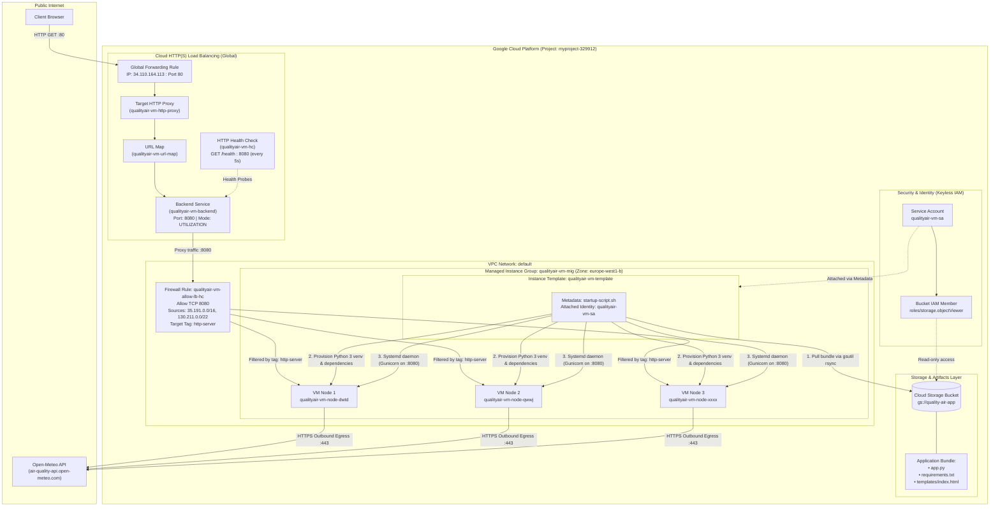
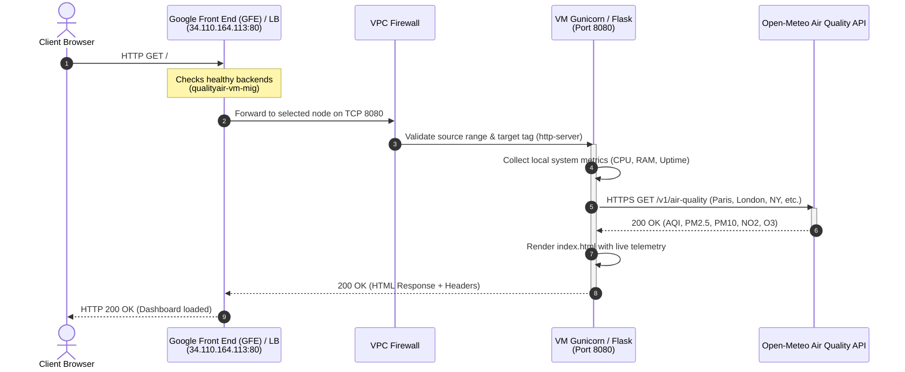
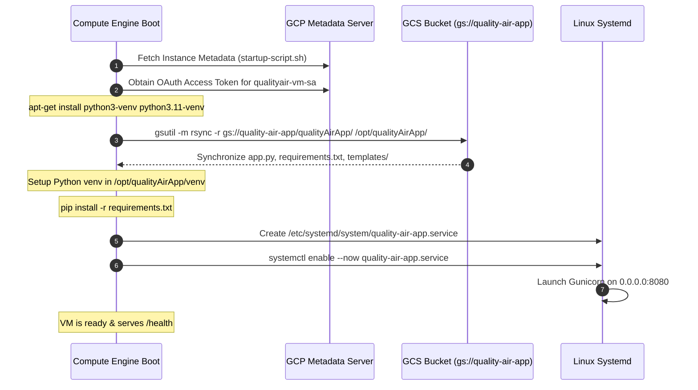

# QualityAirApp — GCP Deployment Architecture

This document details the production architecture, networking, security, and automated deployment pipeline for **QualityAirApp** deployed on Google Cloud Platform (GCP).

---

## 1. High-Level Architecture Diagram



---

## 2. End-to-End Request Flow

The following sequence diagram outlines how an end-user request travels through the load balancing and compute tier, including asynchronous egress calls to the external weather API:



---

## 3. Node Bootstrapping & Continuous Deployment Lifecycle

Each VM instance in the Managed Instance Group executes the following automated bootstrapping sequence during provisioning:



---

## 4. Technical Specifications Summary

| Component | Technical Specification | GCP Resource |
| :--- | :--- | :--- |
| **Public Frontend IP** | `34.110.164.113` (Port 80) | `google_compute_global_forwarding_rule` |
| **HTTP Proxy & Routing** | Global URL Map & Target HTTP Proxy | `google_compute_target_http_proxy`, `google_compute_url_map` |
| **Backend Service** | Port 8080, Protocol HTTP, Balancing Mode `UTILIZATION` | `google_compute_backend_service` |
| **Health Check** | HTTP `GET /health` on port 8080, interval 5s, timeout 3s | `google_compute_health_check` |
| **Managed Instance Group** | Zone: `europe-west1-b`, Target Size: 3, Base: `qualityair-vm-node` | `google_compute_instance_group_manager` |
| **Instance Template** | `e2-micro`, Debian 12 Minimal, Tags: `["http-server", "ssh-enabled"]` | `google_compute_instance_template` |
| **Artifact Storage** | Bucket `gs://quality-air-app/qualityAirApp/` | `google_storage_bucket` |
| **Identity & IAM** | Service Account `qualityair-vm-sa`, `roles/storage.objectViewer` | `google_service_account`, `google_storage_bucket_iam_member` |
| **Firewall** | Ingress 8080 allowed ONLY for `35.191.0.0/16` and `130.211.0.0/22` | `google_compute_firewall` |
| **Application Server** | Python 3.11 + Flask 3.1 + Gunicorn 26.2 (Systemd daemon) | `/etc/systemd/system/quality-air-app.service` |

---

## 5. Security Architecture Highlights

1. **Keyless Authentication (Zero Secrets on Disk):**
   - The VMs authenticate to Google Cloud Storage via the instance metadata server using short-lived OAuth tokens. No private JSON keys are generated, stored, or distributed.
2. **Principle of Least Privilege (PoLP):**
   - `qualityair-vm-sa` only has `roles/storage.objectViewer` scoped directly to `gs://quality-air-app`. It has zero privileges on Compute Engine, IAM, or other buckets.
3. **Restricted VPC Ingress:**
   - Firewall rule `qualityair-vm-allow-lb-hc` exclusively whitelists Google Cloud Load Balancer proxies and health checker subnets (`35.191.0.0/16`, `130.211.0.0/22`). Direct unsolicited internet traffic on port 8080 is blocked by default.

---

## 6. Operational Playbook

### Check Load Balancer Health Status
```bash
gcloud compute backend-services get-health qualityair-vm-backend --global
```

### Zero-Downtime Rolling Update of the MIG
```bash
gcloud compute instance-groups managed rolling-action replace qualityair-vm-mig \
    --zone=europe-west1-b \
    --max-surge=1 \
    --max-unavailable=0
```

### Inspect Instance Group Status
```bash
gcloud compute instance-groups managed list-instances qualityair-vm-mig \
    --zone=europe-west1-b \
    --format="table(name, instanceTemplate.basename(), currentAction, status)"
```

### Check Live Application Logs on a Specific VM Node
```bash
gcloud compute ssh qualityair-vm-node-dwtd --zone=europe-west1-b --command="sudo journalctl -u quality-air-app -n 50 -f"
```
