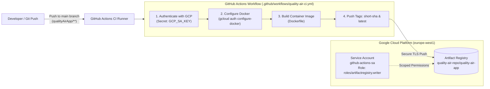

# GitHub Actions CI/CD for QualityAirApp
## Automated Docker Container Build & Push to GCP Artifact Registry

This directory contains the automation scripts, GitHub Actions workflow, and IAM configuration required to build and push container images of **QualityAirApp** to **Google Cloud Artifact Registry** on every push.

---

## 1. CI/CD Architecture Flow



---

## 2. Directory Contents

- **`setup-gcp-service-account.sh`**: One-click bash script to configure GCP, create the Artifact Registry repository, set up the dedicated Service Account with least-privilege IAM permissions, and generate the authentication key.
- **`github-actions.yml`**: GitHub Actions workflow template. An active copy is placed at `.github/workflows/quality-air-ci.yml` at your repository root.

---

## 3. GCP IAM & Permissions Explained

Following the **Principle of Least Privilege (PoLP)**:
- **Service Account Name:** `github-actions-sa`
- **Email:** `github-actions-sa@myproject-329912.iam.gserviceaccount.com`
- **Required Role:** `roles/artifactregistry.writer` (Artifact Registry Writer)
- **Role Scope:** Restricted specifically to the `quality-air-repo` repository (or project-wide).
  - Allows: Reading, writing, and pushing Docker container images.
  - Denies: Access to VMs, Compute Engine, BigQuery, GCS buckets, or IAM admin functions.

---

## 4. Setup in 3 Quick Steps

### Step 1: Run the Automated GCP Setup Script
In your terminal, run the script provided in this folder:

```bash
./qualityAirApp/ci/setup-gcp-service-account.sh
```

This script will automatically:
1. Enable `artifactregistry.googleapis.com`.
2. Create the Docker repository `quality-air-repo` in region `europe-west1`.
3. Create the Service Account `github-actions-sa`.
4. Grant `roles/artifactregistry.writer`.
5. Export `github-actions-sa-key.json`.

---

### Step 2: Add the Secret to GitHub

1. Print the contents of the generated JSON key:
   ```bash
   cat github-actions-sa-key.json
   ```
2. Navigate to your GitHub repository in your web browser:
   - Go to: **Settings** $\rightarrow$ **Secrets and variables** $\rightarrow$ **Actions**
   - Click: **New repository secret**
3. Create the secret:
   - **Name:** `GCP_SA_KEY`
   - **Secret:** Paste the entire JSON content from `github-actions-sa-key.json`
   - Click: **Add secret**
4. Delete the local JSON key from your machine for security:
   ```bash
   rm github-actions-sa-key.json
   ```

---

### Step 3: Trigger the Workflow

The workflow triggers automatically whenever code inside `qualityAirApp/` is committed and pushed:

```bash
git add qualityAirApp/
git commit -m "feat: updated QualityAirApp container"
git push origin main
```

*(You can also trigger it manually from GitHub: **Actions** tab $\rightarrow$ **Build & Push QualityAirApp to GCP Artifact Registry** $\rightarrow$ **Run workflow**).*

---

## 5. Verify Pushed Images in GCP

Once the GitHub Actions workflow finishes, verify your published images in Google Cloud:

```bash
# List container images in your repository
gcloud artifacts docker images list europe-west1-docker.pkg.dev/myproject-329912/quality-air-repo/quality-air-app
```

